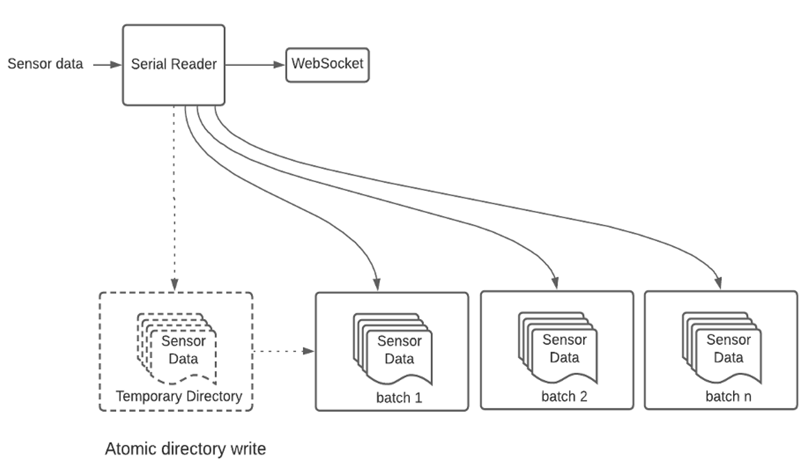
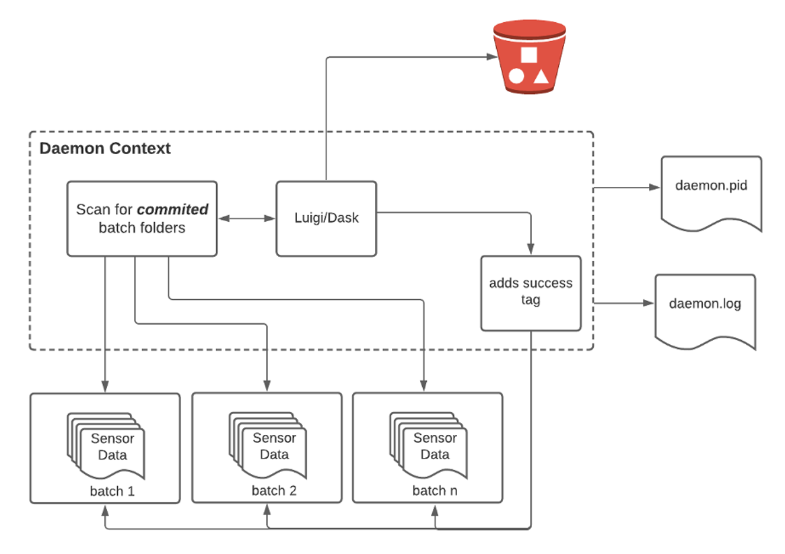
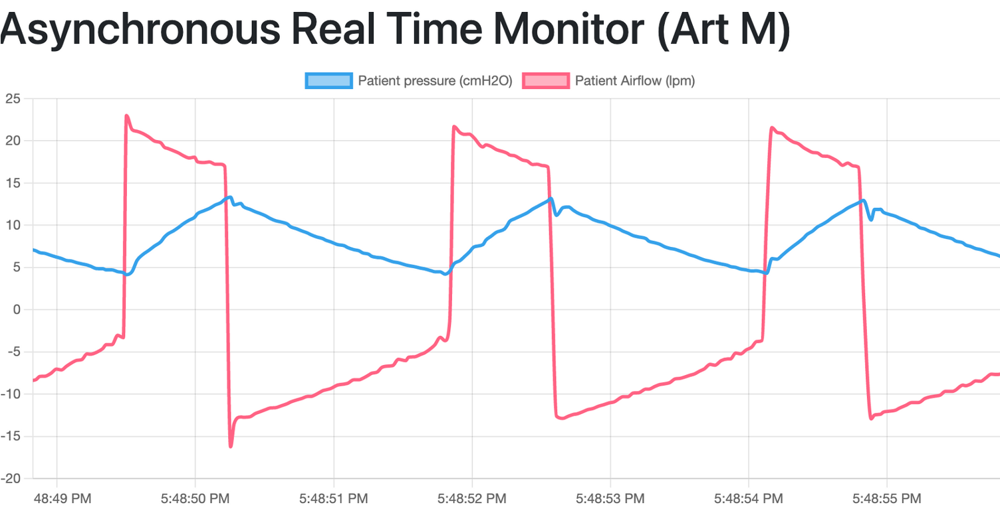
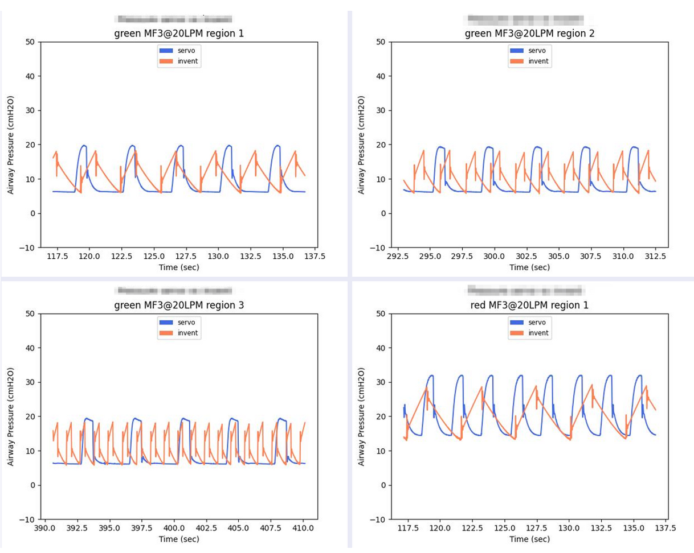

Tool implementation
====================
The project is organized in three main modules:

- Serial Reader
    reads the serial port to acquire sensor data. Also, is responsible to store the info in local files and send (if connection available) a streaming flow using websockets.
- Uploader Daemon
    orchestrator based on luigi/DASK to read the data from the local files and upload them into S3 Buckets
- Streaming and Visualization
    Django site implemented using Channels, receiving the data stream from the serial reader. Also, presents the data as a real time graph.

Serial Reader
#############

**The heart of the system**: uses PySerial library to read the serial port
to collect sensor data coming from the monitor,
then writes the data as csv files in batches (atomically!)
and stream to websocket.

**Atomically designed**: batches are written first in a temporary file,
once the size is reached then the files within the batch is confirmed.
Batch size is controlled by env variables

**cli enabled & logging**: Demo mode: doesn't store files locally
Local mode:  doesn't need to connect to django
Logging activated

**Warning**: if you don't clean up the files it can prevent your
local pc to run!

Uploader
############

**Implemented as a deamon**: Keeps lurking in the background waiting for  data files to be written, to process and upload then to S3 to finally mark the folders as "touched". Warning, Multithread is not parallel!

**DAG for processing and upload**: Reads from sensor data, process all batches and upload to S3 using DASK and Luigi

**FG mode**: Daemon includes option to be executed in the foreground, still generating files

Implemented following **PEP 3143** standard daemon process lib

Django Channels (websockets)
###############################

Django channels was developed as an extension of its regular one way communication protocol (http).
By nature, http is not designed to make realtime connections. For the purpose of two ways communication, Django resorts to the use of websockets
and *awaitable* (async/await) coroutines.

Taking advantage of this capabilities, I was able to implement a reliable real time data streaming channel transmission.
Finally the data was rendered using chart.js and its real time plug, as a javascript page.

The following image is a snapshot of what is displayed live using this system.
The refresh rate has to be adjusted to provide enough speed to show a smooth curve.

Offline (Batch) Analysis
###########################

While the live graphs provide an great way for the researcher to know what is happening and to
tweak the experiment as needed, at the end of the day the data collected in files and uploaded
to Amazon S3 Buckets need to be processed and analyzed to provide the specific insight needed
for different purposes.

This type of analysis is usually customized to the experiment, hence, not a great candidate to
be automated. Instead, I am providing a series of basic transformations using pandas and Matplotlib
for graphical purposes.

These images are an example of the type of waveforms generated offline.

