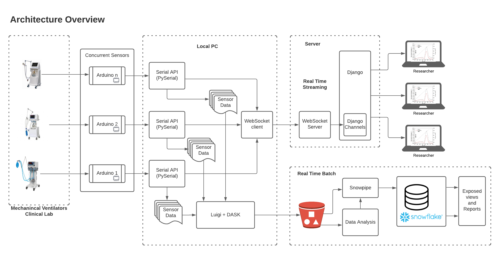

Proposed Solution
======================

The objective of the present project is to provide a platform capable to
process real-time data for displaying and analyzing,
as well as the collection of the data points in a customized
repository for offline analysis and discovery,
as well to provide metadata to link the results with the
devices being tested.

All these in a reliable process that can be
tractable and repeatable.

Architecture overview
------------------------
This image represents a high level architecture

Scope
--------

The scope of the solution includes:

- Coding a solution to read sensor signals from the Arduino Board using its serial port with PySerial

- Code to create stream producers and stream sensor data in real-time using websocket and Django channels in an *awaitable* fashion

- A Web interface using Django to allow the researcher to register the test metadata (e.g. date, device to be tested, objective of test, conditions: lung type, lung compliance, lung resistance, etc) (under development)

- Store time series in a pythonic way, using PyStore instead of a time-series DB

- Use of Luigi to coordinate the ingest of the time series into a snowflake database, using AWS S3 as a staging area for ingestion and snowpipe as ETL.

- A report system to show the results of the test with physiological values: Average Respiration Rest, Tidal Flow, Inspiration/Expiration ratio, PIP, PEEP, etc.

