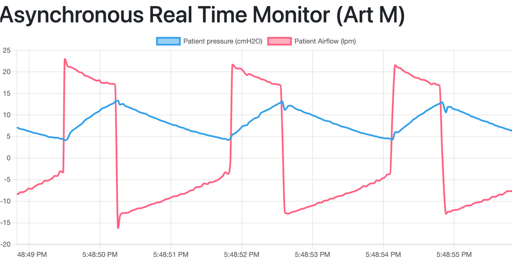

Streaming
=============

Stream's data in real-time fashion using Web Sockets over Django channels

Channels were created to handle asynchronous communication protocol, implementing async/await coroutines.

By nature, http is not designed to make realtime connections. WebSockets are two ways communication channel

